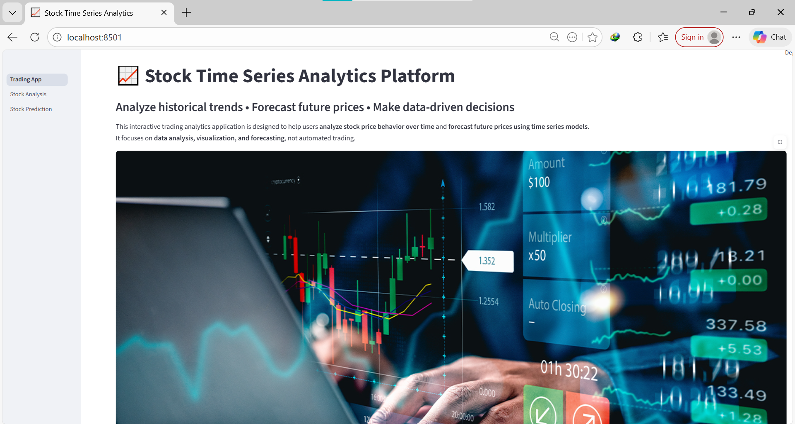
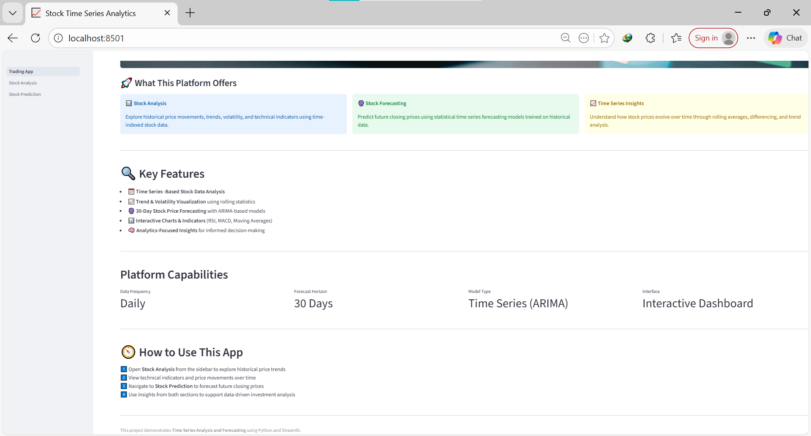
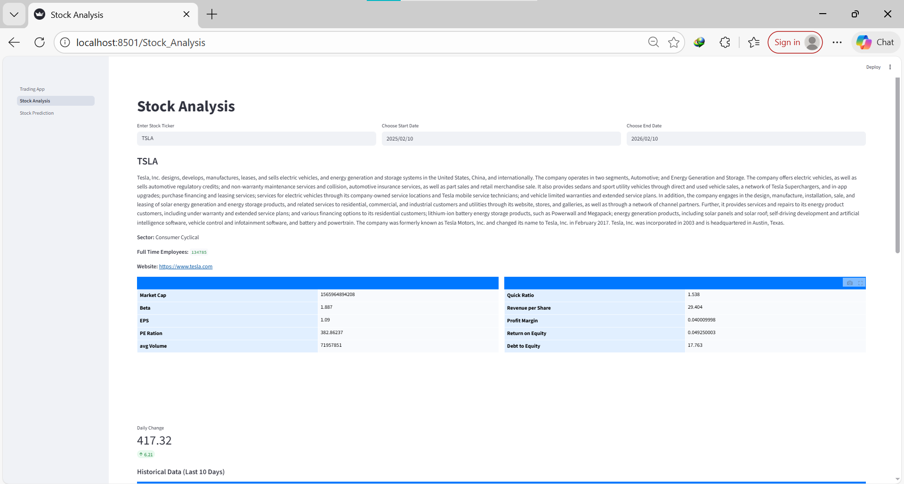
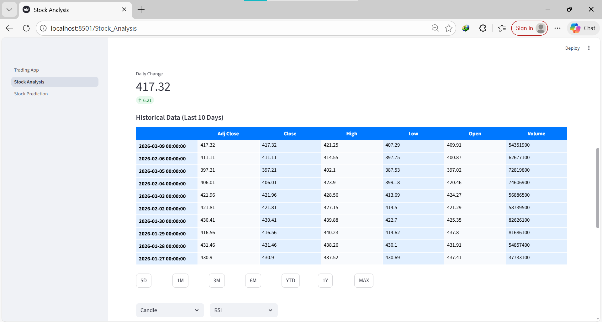
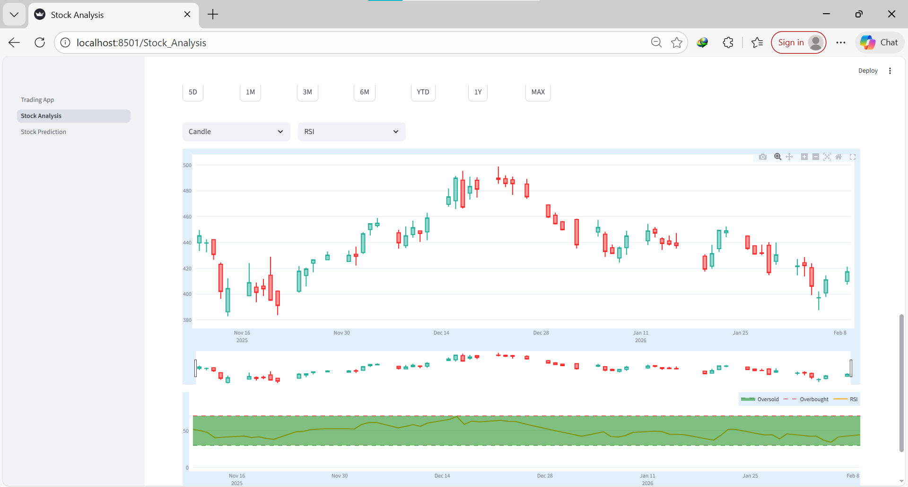
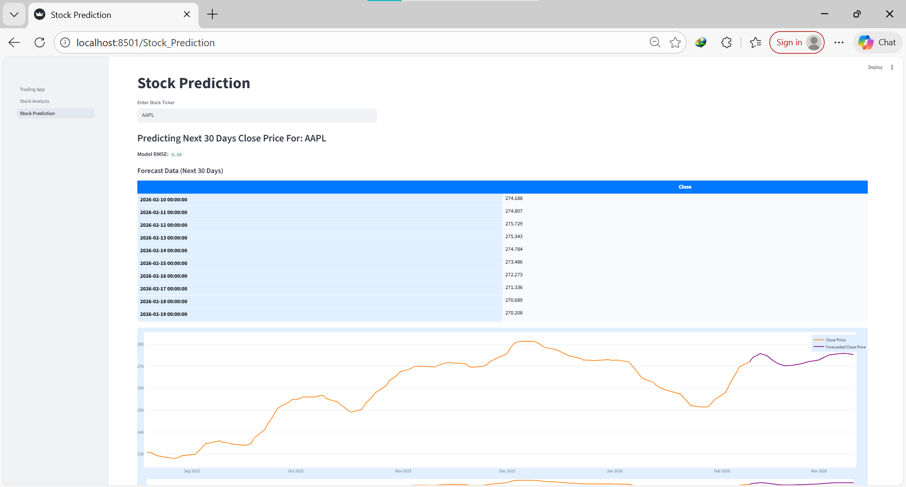
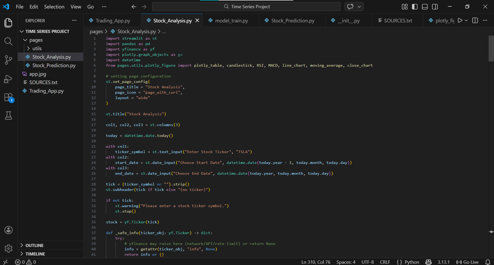

# Stock Analytics & Forecasting using Time Series Analysis

An interactive **Streamlit dashboard** to **analyze historical stock trends** and **forecast the next 30 days of closing prices** using **ARIMA time-series models**.

---

## Results (What you can do)

- **Explore** historical stock price behavior (trend, volatility, OHLC views)
- **Visualize** technical indicators like **RSI**, **MACD**, and **Moving Averages**
- **Forecast** the next **30 trading days** of closing prices with an **ARIMA-based** workflow
- **Evaluate** model performance using **RMSE** (shown directly in the app)

---

## App Preview








---
## Key Features

- 📅 **Time series-based** stock market analysis (daily data)
- 📈 Interactive visualizations with **Plotly**
- 🧠 Technical indicators (e.g., **RSI**, **MACD**, moving averages)
- 🔮 **30-day forecasting** using **ARIMA**
- ✅ Model evaluation via **RMSE** for quick feedback

---

## Tech Stack

- **Python**
- **Streamlit** (web UI)
- **yfinance** (market data)
- **Plotly** (interactive charts)
- **statsmodels** (ARIMA)
- **scikit-learn** (scaling + metrics)
- **pandas / numpy**

---

## How it Works (High-level Pipeline)

1. **Fetch data** from Yahoo Finance using `yfinance`
2. **Preprocess** close prices (rolling mean smoothing)
3. **Check stationarity** using **ADF test**
4. **Auto-select differencing order (d)** until stationarity is achieved
5. **Scale** time series using `StandardScaler`
6. **Train ARIMA** and generate a **30-day forecast**
7. **Inverse-scale** predictions and show:
   - forecast table
   - forecast chart
   - **RMSE** score

> Note: The app is **analytics-focused** and does **not** place trades.

---

## Getting Started

### Prerequisites
- Python **3.9+** recommended
- Internet access (data is fetched live via `yfinance`)

### Installation

```bash
git clone https://github.com/RizwanHussain02/Stock_Analytics-and-Forecasting-using-Time_Series_Analysis.git
cd Stock_Analytics-and-Forecasting-using-Time_Series_Analysis
```

Create and activate a virtual environment:

```bash
python -m venv .venv
# Windows:
.venv\Scripts\activate
# macOS/Linux:
source .venv/bin/activate
```

Install dependencies (recommended approach):

```bash
pip install streamlit yfinance pandas numpy plotly statsmodels scikit-learn pandas_ta python-dateutil
```

> If you add a `requirements.txt` later, replace the install step with:
> `pip install -r requirements.txt`

---

## Run the App

From the repository root:

```bash
streamlit run Trading_App.py
```

Streamlit will open a local URL in your browser (usually `http://localhost:8501`).

---

## Usage Guide

### 1) Stock Analysis Page
- Enter a **ticker** (e.g., `TSLA`, `AAPL`)
- Choose **start** and **end** dates
- Inspect:
  - OHLC and trend charts
  - rolling statistics
  - indicator views (**RSI**, **MACD**, moving averages)

### 2) Stock Prediction Page
- Enter a ticker (default `AAPL`)
- The app:
  - builds a forecasting pipeline
  - prints **Model RMSE**
  - shows a **30-day forecast** table and chart

---

## Project Structure

```text
.
├── Trading_App.py                # Main Streamlit entry point (home/landing)
├── pages/
│   ├── Stock_Analysis.py         # Analysis dashboard page
│   ├── Stock_Prediction.py       # Forecasting dashboard page
│   └── utils/
│       ├── model_train.py        # ARIMA training/forecast utilities
│       └── plotly_figure.py      # Plotly charts + indicator helpers
├── README.md
└── (images)
```

---

## Notes & Limitations

- Data source: **Yahoo Finance** via `yfinance` (may be affected by **rate-limits** or temporary API changes).
- Forecast model: **ARIMA** parameters are fixed in the current implementation; accuracy can vary by ticker/market regime.
- This project is for **learning and analytics**; it is **not financial advice**.

---

## Roadmap (Suggested Improvements)

- Add `requirements.txt` / `pyproject.toml` for reproducible installs
- Let users choose ARIMA `(p, d, q)` or auto-tune via grid search
- Add more models (Prophet, SARIMA, LSTM) for comparison
- Cache data with Streamlit caching to reduce repeated API calls
- Add tests and CI

---
